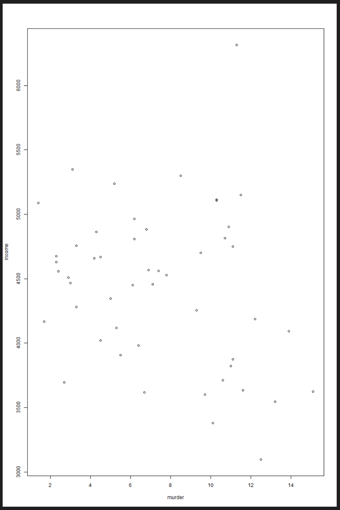
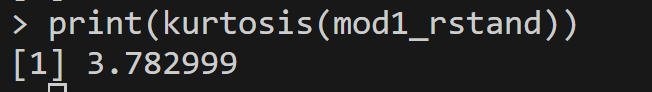

# Submission for Natalie Parrent

# Multiple Regression ICE
Please provide your answers below. Remember, use full sentences. Be clear and detailed in your answers, providing justification and showing any intermediate steps.

Please see [bryan_hammer_ice_multreg.R](/bryan_hammer_ice_multreg.R) for R code solution.

## Assumption validation (10 pts.)
1. Assess the linearity of each independent variable by generating a plot for each one. Please comment on the linearity of each plot. Please save a copy of each plot and link it in [submission.md](/submission.md). (1 pt.)

   ### Population
   With this plot it is a little hard to tell, but I think it could still be considered linear becuase you could draw a straight line across the data. There is more spread on the left compared to the right, but there are no obviouse curves. 
   

   ### Murder
   This plot looks linear with income decreasing along a fairly linear slope as murder rates increase. 

   

   ### Life Expectancy
   This plot looks like a positive slope linear line with increase in life expectancy leading to increased income. 
   

   ### Illiteracy
   This plot looks linear even though there is a lot of bunching towards the left. As illiteracy increases, income decreases and it looks like it has a fairly linear decreasing slope. 

   

   ### High School Graduation
   This plot looks solidly linear with a positive slope. There is one point extemely separated from the rest, however it looks like it still trends within range to the fit line. 

   

   ### Frost
   This plot is also a little hard to tell, but I think it can be considered to have linearity. It seems like you could draw an even line horizontally across plot. 
   

   ### Area
   This plot does not seem to have a linear relationship, or it is at least hard to tell if there is one as all the data sits between first two or three x-axis measures. It appears vertical. 

2. For each plot, indicate whether there are potential outliers based on a visual examination. (1 pt.)
   ### Population
   There is one glaring outlier on the top left of the plot.

   ### Murder
    There seems to be one major outlier sitting at the top right of plot.

   ### Life Expectancy
   Again, one major outlier at top left and possibly a few others but only the one blatant one. 

   ### Illiteracy
   Again, that major outlier lingering outside the rest near top middle of the plot.

   ### High School Graduation
   There is one point extemely separated from the rest, however it looks like it still possibly fall within range trending with the fit line. 

   ### Frost
    There is a big outlier on top right of plot as well as another possible one close to 50 Frost unit on bottom left. 
   

   ### Area
   Again, a major outlier at the top right and a second point that seems to stand out from the crowd in the lower middle section of plot

   
3. Write your conclusion about the normality of the Standardized residuals from this model based on the following assessments. Please comment on each of these assessments.
   1. Q-Q plots (0.5 pts.)
   This dataset of standardized residuals does not seem to pass the normality assessment since the data does not sit very close to the normal line. 
   

   Even when the log was used to transform three variables (popultion, murder, area) to try and fit a better on their plots, the data sit along the normal line better in the center but the edges are still far from the normal line. You can see it clearly crosses the line and looks s-shaped. I would say this residual data is still not normal.
   

   1. histogram (0.5 pts.)
   The histogram looks like it has a little bit of a tail to the right so some right skewness.
   

   1. skewness (0.5 pts.)
   This standardized residual dataset has moderate skewness to the right at 0.724
   

   1. kurtosis (0.5 pts.)
   This residual dataset is lepokurtic being slightly higher than 3 but coming in near 3 means that it is fairly normal. 
   

   1. Kolmogorov-Smirnov Test (0.5 pts.)
   The Kolmogorov-Smirnov Test does not come back significant for the p-value. Both the original model as well as the model for transformed data come back not significant and therefore it is normal.

      

   1. Shapiro-Wilk Test (0.5 pts.)
   The Shapiro-Wilk test does come back significant for both models at at .05 level and there it suggests the data is not normal.
      

4. Plot the standardized residuals against the standardized predictions from the model, and comment on the homoscedasticity (or otherwise) of the residuals. (1 pt.)
   The residual values look evenly distributed (except maybe first outlier in first model). But both models look fairly homoscedastic and the spread of the data is consistant and doesn't change.

   

5. Produce multicollinearity diagnostics for the model and indicate your conclusions. (2 pts.)
   When we look at the correlations, all of the correlations are not very strongly correlated with the exception of murder on life expectancy which is at .78 and murder on illteracy at .70. This isn't extremely high, but it is starting to creep up there. 
   

   If we then use the ulsrr method to test for multicolinearity we find that the tolerance scores and VIF scores are slightly out of range and suggest the potential for multicolinearity happening for murder. The murder tolerance rate is .19 which is just under the threshold of .2 and the VIF is over the threshold of 5-10 at 5.17 which suggests that multicolinearity exists. Illiteracy is pushing up against these limits as well, with tolerance of .23 and VIF of 4.34. 

   

   Using the Durbin-Watson test we get the same results:

   

6. Produce the outlier diagnostics (i.e., Leverage, Studentized Residuals, and Cook’s D) for the all observations in the model. Identify the observation (i.e., its ID) with highest Cook’s D value. Interpret its Leverage (what it means), its Studentized Residual (what it means) and its Cook’s D (what it means). (2 pts.)

   ### Population
   For this data, the highest Cooks'D value of (0.2046) is found on line 2 with income of 6315. The leverage at 0.0354 is similar to the other numbers. In other words, it is in line with the rest of the data and it means that is is not that far away from the mean of X. Data on line 5 has a much higher leverage of 0.3142. The studentized residual (SR) is high for Line 3 at 3.77 relative to other SRs in the group, therefore it does have an unusually predicted Y value.  Therefore this datapoint could be pulling the regression model towards this value. Cook's distance takes into account the regression models with and without datapoint from line 2. With a result of 0.204 this is not over 0.5 threshold as a potential outlier, however, it does stick out like a sore thumb compared to the rest of the data and therefore should be considered an outlier. 

   
   

   ### Murder
    The Cook D with highest Cook's D value is line 2 at 0.2651 and income of 6315. This value is way outside the range within the rest of the dataset and it means that when compared to a model that has it included vs. not included there is a difference. This can be considered an outlier based on this. The leverage is 0.04 and fits within range of the other values. The studentized residuals are much higher than the rest of the data set at 3.91 and this suggests that there is an unusual predicted value for Y.

    
   

   ### Life Expectancy
   The Cook D with highest Cook's D value is line 2 at 0.3493 and income of 6315. This value is way outside the range within the rest of the dataset and it means that when compared to a model that has it included vs. not included there is a difference. The leverage is in line with the other at 0.04 but the studentized residual is super high compared to the rest of the group at 4.37 and can be considered a potential outlier. 

   

   

   ### Illiteracy
   The Cook D with highest Cook's D value is line 2 at 0.1800 and income of 6315. This value is way outside the range within the rest of the dataset and it means that when compared to a model that has it included vs. not included there is a difference. The leverage is in line with the other at 0.0260 but the studentized residual is super high compared to the rest of the group at 4.29 and can be considered a potential outlier. 

   
   

   ### High School Graduation
   The Cook D with highest Cook's D value is line 2 at 0.2955 and income of 6315. This value is way outside the range within the rest of the dataset and it means that when compared to a model that has it included vs. not included there is a difference. The leverage is in line with the other at 0.0778 but the studentized residual is super high compared to the rest of the group at 2.834 and can be considered a potential outlier. 

   
   

   ### Frost
    The Cook D with highest Cook's D value is line 2 at 0.1678 and income of 6315. This value is way outside the range within the rest of the dataset and it means that when compared to a model that has it included vs. not included there is a difference. The leverage is in line with the other at 0.0371 but the studentized residual is super high compared to the rest of the group at 3.2294 and can be considered a potential outlier. 

    
    

   ### Area
   The Cook D with highest Cook's D value is line 2 at 4.5167 and income of 6315. Not only is this value is way outside the range within the rest of the dataset, it is also much greater than 1 and is likely influential. The leverage is also elevated compared to the other datapoints. This indicates that this value is sitting further out in the tails. The studentized residuals are not really that far out of line compared to the rest of the data at 1.99. 

   
   
